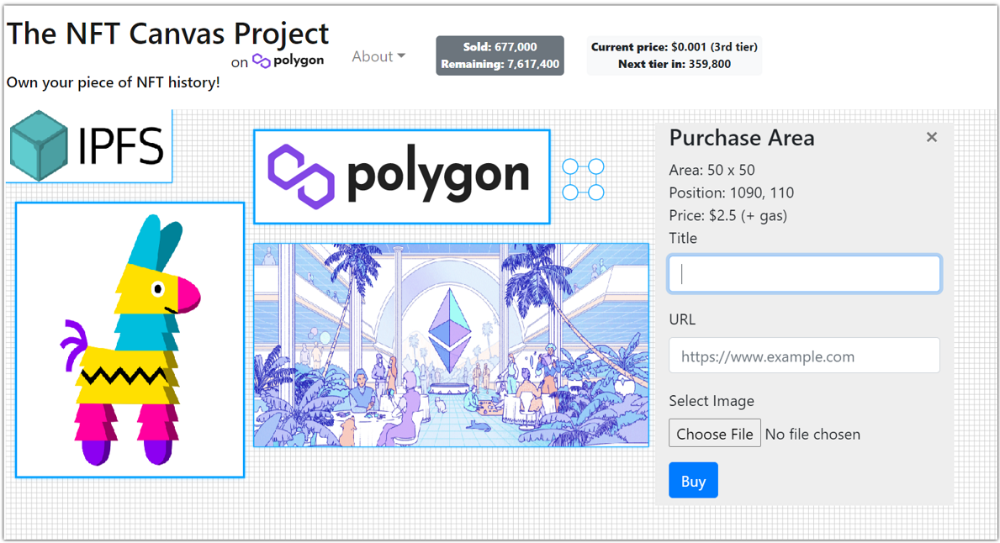

# [The NFT Canvas Project](https://www.nftpolygon.com/)
This project is an experiment at minting NTFs to cover a full 4K (3840 x 2160 pixels) screen, using the Polygon blockchain.

Check it out at **[The NFT Canvas Project](https://www.nftpolygon.com/)**

  

How it works:
* Pick an area to buy.
* Put your own image and link on it for everyone to see.
* Your area is minted as an NFT and lives on the Polygon blockchain forever!
* Also, everything here is decentralized and enforced by a smart contract.

# Implementation
The NFT Canvas Project is a Dapp (decentralized app). It is comprised of:
* A contract that lives on the Polygon blockchain
* NTFs that are minted when areas are bought and which also live on the blockchain
* The NTF's metadata (title, link and image) that lives on IPFS, a decentralized global shared file system
* The front-end web app, which also lives on IPFS

## NFT Canvas contract

[NFTCanvas.sol](contracts/NFTCanvas.sol) implements the contract. It's an ERC721 ownable, pausable and burnable token derived from OpenZeppelin's [base class](https://docs.openzeppelin.com/contracts/4.x/erc721). The contract is initialized with a list of price ranges, number of blocks per price range and maximum amount of blocks that are allowed to be purchased per price range. These are used to enable a price range step-ladder so that prices can change as more areas are purchased. The contract maintains a mapping of owned block ids. When an area is purchased, the caller passes in the area coordinates and the token uri. The coordinates are encoded into a token id and the token is minted. As part of this, we verify that the block ids corresponding to the area are not already owned and mark them as owned. The price is determined using Chainlink's on-chain price [feed oracle](https://docs.chain.link/docs/matic-addresses/). The contract supports other functions, like setting metadata on an already purchased area (if the owner wants to update the metadata).

[Hardhat](https://hardhat.org/) is used as the Ethereum development environment. It manages compiling the contract using [Solidity](https://soliditylang.org/). Contract unit testing is done with [ethers.js](https://docs.ethers.io/), [Waffle](https://getwaffle.io/) and [Chai](https://www.chaijs.com/).

## CanvasDataUpdater

This component is used for two purposes: 1) To pin images uploaded to the canvas so they are long-lived in IPFS and 2) to maintain an up-to-date cache of the canvas data, also in IPFS. This allows the front-end to read canvas data without needing to connect to a wallet (to access the contract data from the blockchain).

The details are as follows: For each minted token, we maintain an in-memory cache of the token metadata (token id, owner address, uri, image IPFS hash). On initialization, we connect to the blockchain (i.e. Ethereum, Polygon, etc) via a JSON-RPC provider (in this case, using [Matic RPC](https://rpc.maticvigil.com)) and populate the token metadata cache by reading the contract data. We also set up listeners for contract events (ownership transfer or minting events) to update the token metadata cache on changes.

On intialization and updates, we generate a JSON representation of the token metadata cache and perform the following steps:
1) Upload the JSON representation to IPFS, using [Infura](https://infura.io)
2) Pin it with a pinning service, using [Pinata IPFS](https://www.pinata.cloud/)
3) Create / update the front-end site's TXT DNS record to point to the IPFS hash (created in step #1) via [CloudFlare](https://www.cloudflare.com/). This allows the front-end to locate the latest contract data cache. See [DNSLink](https://docs.ipfs.io/concepts/dnslink/) for more details.
4) We also pin all token uris and image hashes to ensure anything uploaded to IPFS via the front-end is long-lived. Note that pinning unchanged data is a no-op.

Finally, we also periodically unpin entries that are no longer in use - meaning, not referenced by the current metadata cache. This helps minimize storage consumed by the IPFS pinning service.

## Front-end App

The front-end component of the Dapp is a React single-page website hosted in IPFS. The app is comprised of a set of [React](https://reactjs.org/) functional components. There are a few interesting highlights to point out:
- Prior to any wallet being connected, the app loads the latest canvas data cache from IPFS that was published by the CanvasDataUpdater component described above. The app periodically polls for any changes to the cache. The latest cached content is resolved using Cloudflare's IPFS gateway using [IPNS](https://docs.ipfs.io/concepts/ipns/).
- The wallet connects to an [ethers provider](https://ethers.io/) like [Metamask](https://metamask.io/). On mobile, [Trust Wallet](https://trustwallet.com/) can also be used. Once connected, canvas data is initialized directly from the contract. In addition, listeners are set up for transfer and purchase events.
- When purchasing an area, the app publishes the token metadata JSON file and corresponding image to IPFS, using [Infura](https://infura.io)'s IPFS host. After data has been published to IPFS, it then invokes the contract's purchase API, passing in the token uri (constructed from the CID returned by IPFS) and area size.
- The canvas grid leverages [Konva](https://konvajs.org/), which is an HTML5 2d canvas library.
- In terms of deployment, after building via [Webpack](https://reactjs.net/bundling/webpack.html), the app is published to IPFS using [Infura](https://infura.io) and pinned via [Pinata](https://www.pinata.cloud/). [DNSLink](https://docs.ipfs.io/concepts/dnslink/) is used to update the txt record of the host site to point to the IPFS hash of the site. The way this works is that the CNAME record of the site points to CloudFlare's [IPFS gateway](https://www.cloudflare.com/distributed-web-gateway/). The TXT entry \_dnslink.www points to the CID (content identifier - i.e. the IPFS hash of the site). Cloudflare's IPFS gateway looks up this TXT entry and redirects the client to the appropriate content on its IPFS gateway. CloudFlare also supports end-to-end HTTPS via this mechanism (by issuing auto-renewed SSL certs for the site).

## Build, Test, Deploy

### Contract
Under the base path:

Build the contract: ``npm run compile``  
Run contract tests:  ``npm run test``  
Deploy the contract:
* To localhost: ``npm run deploy``
* To Mumbai test network: ``npm run deploy:mumbai``
* To Polybase main net: ``npm run deploy:polygon``

### CanvasDataUpdater:
Under CanvasDataUpdater, start as:
* localhost: ``npm run start``
* Mumbai test network: ``npm run start:mumbai``
* Polygon mainnet: ``npm run start:polygon``

### Front-end
Under frontend, start as localhost: ``npm run start``  

Build as:
* localhost: ``npm run build``
* Mumbai test network: ``npm run build:mumbai``
* Polygon mainnet: ``npm run build:polygon``

Deploy as:
* Mumbai test network: ``npm run deploy:mumbai``
* Polygon mainnet: ``npm run deploy:polygon``
